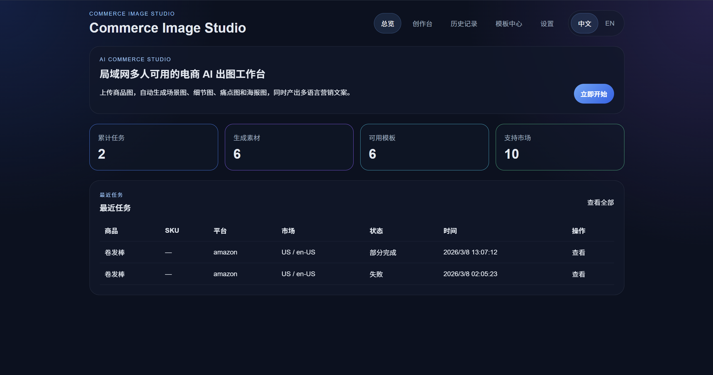
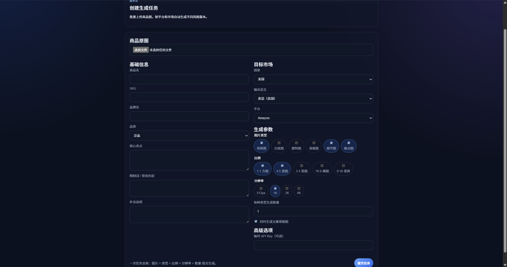
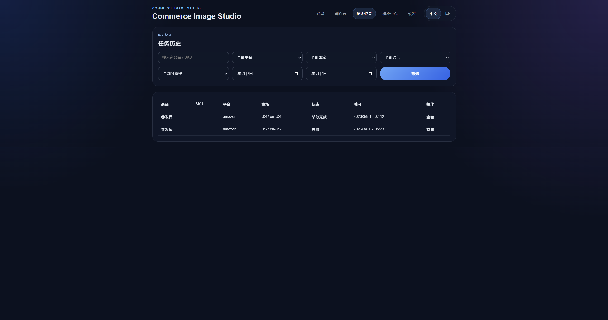
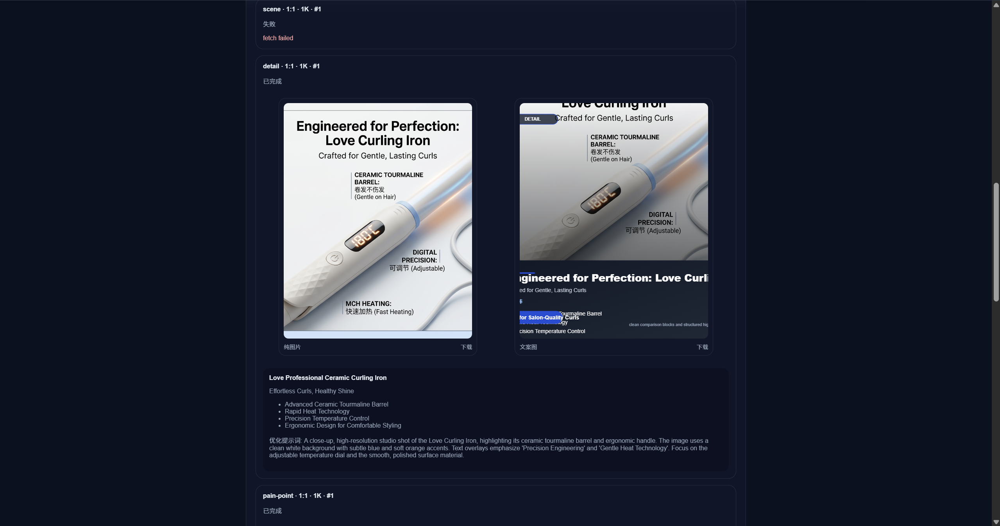
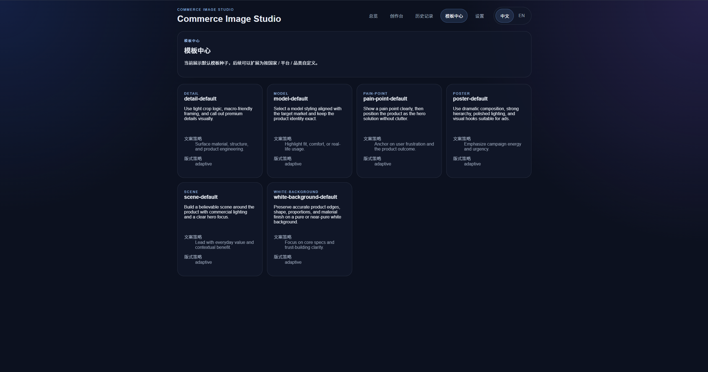
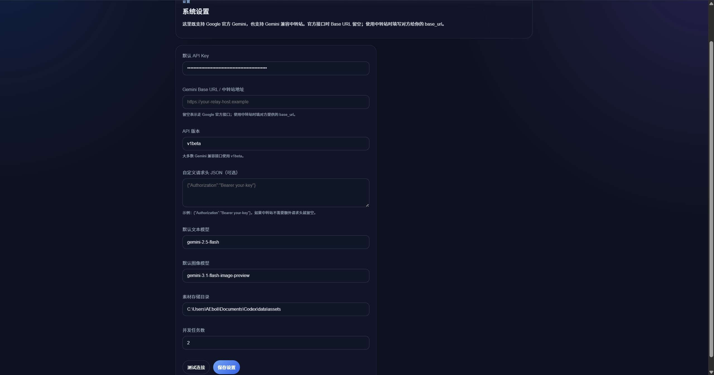

# Commerce Image Studio

Commerce Image Studio is a local-network friendly e-commerce image generation workstation built with Next.js, SQLite, local file storage, and Gemini-compatible image generation backends. It is designed for product teams who need fast batch output for marketplace visuals, poster-style creatives, and reusable product copy.

The application supports both the official Google Gemini API and Gemini-compatible relay providers, so it can run in environments where a relay `base_url` and custom request headers are required.

For Chinese operating notes, see [使用说明-简体中文.md](./使用说明-简体中文.md).

## Highlights

- Batch-create product visuals from uploaded source images
- Generate multiple output types in one job: scene, white background, model, poster, detail, and pain-point variants
- Produce both pure image output and copy-layout creative output
- Save job history, prompts, copy blocks, generated assets, and retryable records in SQLite
- Store all source and generated assets on local disk
- Switch between Chinese and English in the UI
- Configure official Gemini or Gemini-compatible relay providers from the Settings page
- Test provider connectivity before saving configuration

## Product Workflow

1. Open the application and configure the provider in `Settings`.
2. Upload one or more product images in `Studio`.
3. Fill in product metadata, market, language, platform, image types, ratios, resolution, and quantity.
4. Submit the job and let the queue generate copy, optimized prompts, and image variants.
5. Review results in `Job details`, download output files, or rerun the job.
6. Use `History` to filter previous jobs and manage older batches.

## Screen-by-Screen Guide

The following UI notes are based on the current product screens used for documentation.

### 1. Overview

The Overview dashboard is the landing screen of the app. It gives operators a fast summary of the current workspace state:

- A hero section that explains the purpose of the tool and links directly to the creation flow
- KPI cards for total jobs, generated assets, available templates, and supported markets
- A recent jobs table for quick access to the latest tasks
- A language toggle for switching between Chinese and English



### 2. Studio

The Studio page is the main creation form. It is designed for structured batch generation and contains the full input set needed to build a job:

- Source image upload
- Product metadata such as product name, SKU, brand, category, selling points, restrictions, and extra notes
- Market configuration including country, output language, and marketplace platform
- Variant selection for scene, white-background, model, poster, detail, and pain-point image types
- Ratio selection such as `1:1`, `4:5`, `3:4`, `16:9`, and `9:16`
- Resolution selection such as `512px`, `1K`, `2K`, and `4K`
- Per-combination quantity control
- Optional copy-layout generation
- Temporary API key override for one-off jobs



### 3. History

The History page is the operational index for finished, partial, and failed jobs. It includes filters that help teams locate past runs quickly:

- Product name or SKU search
- Platform filter
- Country filter
- Language filter
- Resolution filter
- Date range filter



### 4. Templates

The Template Center exposes the built-in creative directions used by the generator. Current default templates include:

- `detail-default`
- `model-default`
- `pain-point-default`
- `poster-default`
- `scene-default`
- `white-background-default`



### 5. Job Details

The Job Details page is the review surface for a single generation task. It shows:

- Uploaded source images
- Variant status per image type, ratio, resolution, and index
- Generated pure images
- Generated layout creatives
- Generated title, subtitle, and highlights
- Optimized prompts used for the image request
- Error messages for failed variants
- Download actions for each generated asset
- A rerun action to create a new job from the same parameters



### 6. Settings

The Settings page controls provider and storage behavior. It supports both Google Gemini and Gemini-compatible relay services. Main fields include:

- Default API key
- Gemini base URL / relay URL
- API version
- Custom headers JSON
- Default text model
- Default image model
- Asset storage directory
- Max concurrent jobs
- Connection test action

Recommended defaults:

- API version: `v1beta`
- Text model: `gemini-2.5-flash`
- Image model: `gemini-2.5-flash-image`
- Max concurrency: `1` or `2` for stable operation



## Provider Configuration

### Official Google Gemini

- Paste the official Gemini API key into `Default API key`
- Leave `Gemini base URL / relay URL` empty
- Keep `API version` as `v1beta` unless your provider documentation says otherwise
- Leave custom headers empty unless you explicitly need them

### Gemini-Compatible Relay

- Paste the relay-issued key into `Default API key`
- Paste the relay `base_url` into `Gemini base URL / relay URL`
- Keep `API version` aligned with the relay documentation, usually `v1beta`
- Fill `Custom headers JSON` only if the relay requires additional headers

Example header JSON:

```json
{"Authorization":"Bearer your-key"}
```

The `Temporary API key` field in the Studio page overrides the saved default key for that job only.

## Local Data Storage

By default, the application stores working data locally:

- Database: `data/commerce-image-studio.sqlite`
- Assets: `data/assets`

Do not delete these locations casually if you want to keep job history and generated files.

## Running the Project

### Option 1: Use the production launcher

Double-click:

- `启动正式版.bat`

The launcher:

- selects a free port in the `3000-3005` range
- installs dependencies if needed
- builds the app
- starts the production server
- opens the local browser automatically

### Option 2: Run in development mode

```bash
npm install
npm run dev -- --hostname 127.0.0.1 --port 3000
```

### Open the app

- Local machine: `http://127.0.0.1:3000`
- LAN example: `http://<your-local-ip>:3000`

If you need LAN access, start the server with host `0.0.0.0` in your own launch flow.

## Packaging and Delivery

Safe packaging is supported for distribution to other machines. The release workflow can sanitize secrets before export so that default API keys and custom request headers are not shipped by mistake.

Common packaging commands:

```bash
npm run package:release:safe
npm run package:release:safe:zip
npm run package:installer:exe:safe
```

These scripts generate portable builds, ZIP packages, or a single-file installer, depending on the command used.

## FAQ

### The website does not open

Check the following first:

- Make sure you are in the correct project directory
- Keep the helper terminal window open after launching the app
- Confirm that the selected port is not already occupied
- If needed, hard refresh the browser after the server starts

### The Settings connection test fails

Typical causes:

- Invalid API key
- Wrong relay `base_url`
- Wrong API version
- Invalid custom headers JSON
- Relay provider incompatibility

Start with the smallest valid configuration: API key, optional relay base URL, `v1beta`, and no extra headers.

### A job fails with `fetch failed` or partial output

Typical causes:

- Relay endpoint is unreachable or incompatible
- Model name is invalid
- Too many combinations were submitted in one batch
- Provider rate limit or quota was hit

Reduce the first test to a single image, one image type, one ratio, one resolution, and quantity `1`.

### The image was generated but cannot be previewed or downloaded

This project already includes fixes for asset preview and download headers, including Chinese filenames. If you still see stale behavior:

1. Restart the application
2. Refresh the browser with `Ctrl + F5`
3. Check whether the specific asset file exists under `data/assets`

### I want to share the tool with another PC

Use one of the safe packaging commands so the exported build does not keep your saved default API key or custom request headers. The receiving machine should re-enter its own provider settings after startup.

### I want other computers on the LAN to use it

Run the app on a reachable host, confirm the firewall is not blocking Node.js, then open the server with:

```text
http://<your-local-ip>:<port>
```

All client devices must be on the same local network.

## Repository Notes

- This repository contains source code, not release artifacts
- Release folders, generated output, temporary files, and local databases are ignored in Git
- The main English product README is this file
- The detailed Chinese operator guide lives in `使用说明-简体中文.md`

## License

Add your preferred license before publishing beyond private use.


